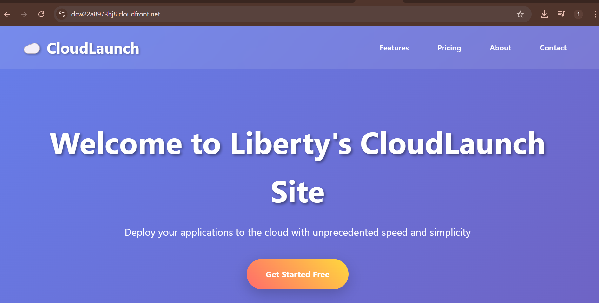

# CloudLaunch AWS Infrastructure Setup

A platform that showcases a basic company website and stores some internal private documents.

---

## Task 1: AWS S3 Static Website Hosting with IAM Permissions

### 📌 Overview
This task involved setting up a static website hosted on **Amazon S3**, securing access with an **IAM user**, and enforcing **least privilege** principles. The goal was to deploy a simple static website and provide controlled access via IAM, ensuring that only the required resources are accessible.

---

### ✅ Steps Completed

#### 1. Create and Configure an S3 Bucket
- Created an S3 bucket named: `cloudlaunch-site-bucket-libby`.
- Enabled **static website hosting** on the bucket.
- Configured the **index document** as `index.html` and an `error.html`.

#### 2. Bucket Policy (Public Access for Website Content)
Attached a bucket policy to allow **public read access** for objects:

```json
{
  "Version": "2012-10-17",
  "Statement": [
    {
      "Sid": "PublicReadGetObject",
      "Effect": "Allow",
      "Principal": "*",
      "Action": "s3:GetObject",
      "Resource": "arn:aws:s3:::cloudlaunch-site-bucket-libby/*"
    }
  ]
}
```

- Block Public Access was modified to allow static hosting.
- Verified that the website is publicly accessible.

#### 3. IAM User Creation
- Created an IAM user: `cloudlaunch-user-libby`.
- Configured programmatic access (Access Key & Secret Key).
- Attached a custom IAM policy to restrict access.

#### 4. IAM Policy for S3 Read-Only Access
Attached the following JSON IAM Policy to `cloudlaunch-user-libby` to grant read-only access to the S3 static site:

```json
{
  "Version": "2012-10-17",
  "Statement": [
    {
      "Effect": "Allow",
      "Action": [
        "s3:GetObject",
        "s3:ListBucket"
      ],
      "Resource": [
        "arn:aws:s3:::cloudlaunch-static-site",
        "arn:aws:s3:::cloudlaunch-static-site/*"
      ]
    }
  ]
}
```

This ensures cloudlaunch-user can only view objects inside the S3 bucket. No write, delete, or admin privileges are granted.

#### 5. Enforce Secure Login
- Generated login credentials for `cloudlaunch-user-libby`.
- Configured to force password reset on first login.
- Restricted permissions to follow least privilege best practices.

### 🔗 Website Links

**S3 Static Website URL:**  
[http://cloudlaunch-site-bucket-libby.s3-website.eu-north-1.amazonaws.com/](http://cloudlaunch-site-bucket-libby.s3-website.eu-north-1.amazonaws.com/)

**CloudFront Distribution URL:**  
[https://dcw22a8973hj8.cloudfront.net/](https://dcw22a8973hj8.cloudfront.net/)



---

## Task 2 – VPC and Subnet Configuration

### Overview

In this task, I created a custom **Virtual Private Cloud (VPC)** to host both public and private resources for the CloudLaunch project. The goal was to design a secure and scalable networking architecture that separates internet-facing resources from internal-only resources.

The following steps were carried out:

### 1. VPC Creation

* Created a VPC named **cloudlaunch-vpc** with the CIDR block **10.0.0.0/16**.
* This allows up to **65,536 private IP addresses**, giving enough room for subnetting.

### 2. Public Subnets

I created two **public subnets** that will host internet-facing resources such as load balancers or a bastion host.

* **cloudlaunch-public-subnet-1** → CIDR: `10.0.1.0/24` (Availability Zone 1)
* **cloudlaunch-public-subnet-2** → CIDR: `10.0.2.0/24` (Availability Zone 2)

✅ These subnets are associated with a **route table** that routes traffic to an **Internet Gateway (IGW)**, making them public.

### 3. Private Subnets

I created two **private subnets** that will host backend resources such as application servers and databases.

* **cloudlaunch-private-subnet-1** → CIDR: `10.0.3.0/24` (Availability Zone 1)
* **cloudlaunch-private-subnet-2** → CIDR: `10.0.4.0/24` (Availability Zone 2)

✅ These subnets **do not** have a direct route to the internet. Instead, they communicate externally via a **NAT Gateway** deployed in the public subnet.

### 4. Route Tables and Internet Gateway

* Attached an **Internet Gateway (IGW)** to the VPC for external access.
* Created a **Public Route Table** and associated it with the two public subnets. This table contains a default route (`0.0.0.0/0`) pointing to the IGW.
* Created a **Private Route Table** and associated it with the two private subnets. This table contains a default route (`0.0.0.0/0`) pointing to the **NAT Gateway**.

### 5. Security Groups

* Created a **Public SG** (for load balancer/bastion) allowing inbound **HTTP (80), HTTPS (443), and SSH (22)** from trusted IPs.
* Created a **Private SG** (for app servers/DB) allowing inbound traffic **only from the public SG** and **within private subnet communication**.

### 6. Verification

* Verified that resources in the **public subnet** are internet accessible.
* Verified that resources in the **private subnet** cannot be reached directly from the internet, but can access the internet via NAT for updates and dependencies.

---